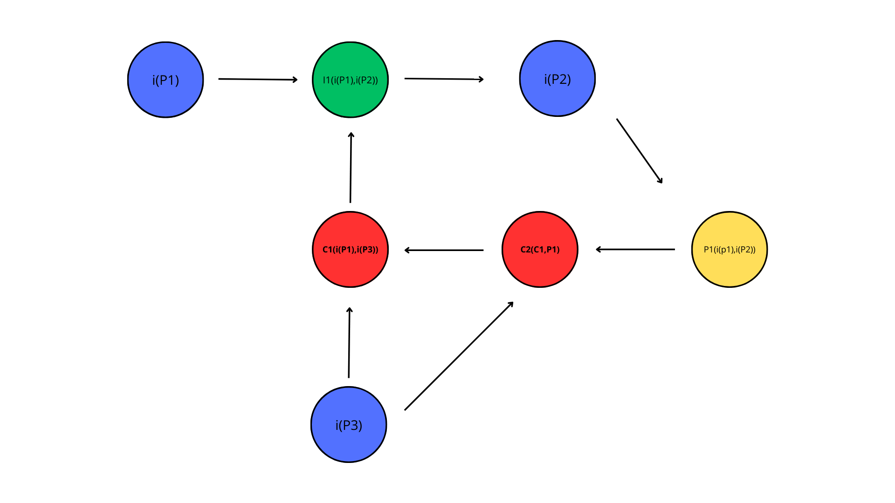
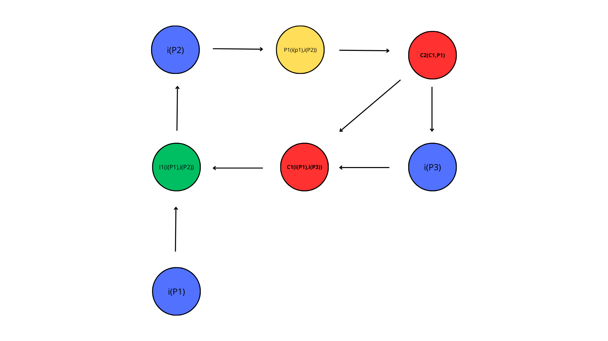

# Argumentação

**Histórico de Revisão**

| Data       | Versão | Descrição                      | Autor             |
| :--------: | :----: | :----------:                   | :---------------: |
| 20/08/2024 |  0.1   | Criação dos Argumentos | [Samara Letícia](https://github.com/samarawwleticia)|

A argumentação em requisitos de software é o processo de justificar e validar as necessidades de um sistema, construindo uma base lógica e convincente para cada requisito. Ela visa garantir que os requisitos sejam claros, completos e alinhados com os objetivos do projeto, evitando mal-entendidos e facilitando a tomada de decisões durante o desenvolvimento.

 <i class="fa-solid fa-circle-info"></i> Versão 1 - Diagrama de Argumentação 1

## **Questão:** Fazer apenas dois casos de uso será o suficiente para o nosso projeto?

**P1** - Sim, pois eles cobrem os principais fluxos do sistema, garantindo que as funcionalidades essenciais estejam completamente descritas e validadas.

**P2** - Sim, pois não seria possível capturar todos os cenários possíveis uma vez que é um jogo de exploração livre.

**P3** - Não, pois dois casos de uso podem não capturar todas as variáveis e cenários possíveis, o que pode resultar em lacunas na cobertura de requisitos e funcionalidades importantes do sistema.

### **Conclusão**

Terão apenas dois casos de uso, e se necessário, faremos mais.

 <i class="fa-solid fa-circle-info"></i> Versão 1 - Diagrama de Argumentação 2

## **Questão:** É necessário fazer uma pesquisa de interesses com jogadores de minecraft para cobrir bem os requisitos?

**P1** - Sim. A pesquisa de interesses reduz o risco de falhas ao detalhar os recursos ou projetos relacionados a Minecraft.

**P2** - Sim, com uma pesquisa bem conduzida, é possível identificar as funcionalidades ou elementos do projeto que têm maior impacto.

**P3** - Não acho que seja necessário porque sozinhos já conseguiríamos identificar os pontos principais do jogo.

### **Conclusão**

Fizemos um questionário para jogadores de minecraft a respeito do jogo.
