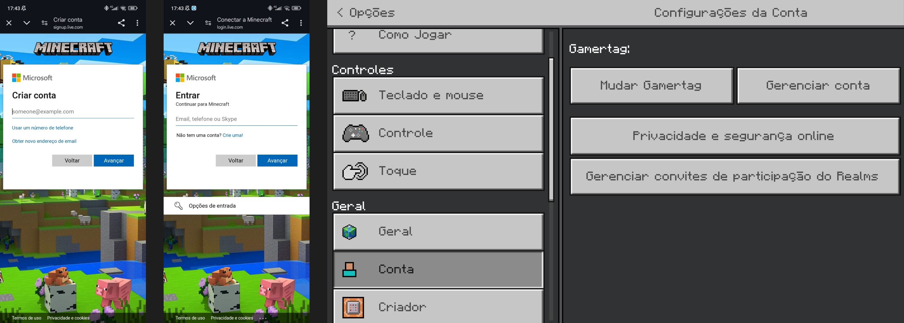

# Validação
**Histórico de Revisão**

| Data   | Versão  | Descrição | Autor(es)|
| --- | --- | --- | --- |
| 08/09/2024 | 0.1 | Criação do documento e adição dos requisitos funcionais | Samara Letícia |
| 09/09/2024 | 0.2 | Adição RF54 a RF61 | Carlos Eduardo Rodrigues |

## Introdução

Validação é o processo de submeter os requisitos à aprovação externa da equipe de software, verificando se atendem às necessidades dos stakeholders e evitando custos de correções.

## Metodologia

Após levantarmos os requisitos, testamos e validamos cada um em diferentes ambientes do jogo.

### RF01 - O usuário deve ser capaz de criar, entrar e gerenciar uma conta no Minecraft.

### RF02 - O usuário deve ser capaz de se locomover utilizando o teclado.

### RF03 - O usuário deve ser capaz de interagir com o mundo utilizando o mouse.

  
### RF04 - Os recursos devem ser armazenados no inventário do usuário.

### RF05 - O jogo deve possuir um dicionário com a explicação de todos os itens descobertos pelo usuário. 

### RF06 - O usuário deve precisar de uma mesa de trabalho para fabricar ferramentas eficientes.

### RF7 - O jogo deve permitir que, através de minérios, o usuário crie novas ferramentas. 

### RF08 - O jogo deve oferecer diferentes tipos de alimentos para evitar que o personagem do usuário morra de fome. 

### RF09 - No modo hardcore, o usuário deve ter apenas uma vida, tornando o jogo mais desafiador e definitivo. 

### RF10 - No modo hardcore, após a morte, o usuário deve ser capaz de entrar apenas no modo espectador, sem interagir com o mundo. 

### RF11 - No modo hardcore, o jogo deve ser definido automaticamente na dificuldade mais alta e não pode ser alterado.   

### RF12 - No modo hardcore, os comandos de cheats devem estar desabilitados para garantir a integridade do desafio. 

### RF13 -  Deve existir um modo de jogo onde o jogador pode exercitar a sua criatividade 

### RF14 - No modo criativo, o usuário deve ser capaz de sobrevoar rapidamente pelo mapa para facilitar as criações.

### RF15 - O usuário deve ser capaz de colocar e quebrar blocos com apenas um comando no modo criativo. 

### RF16 - O usuário deve ter acesso a todos os itens do jogo no modo criativo. 

### RF17 - O usuário não deve precisar se preocupar com vida ou barra de fome no modo criativo, focando apenas em criar. 

### RF18 - Mobs hostis devem ignorar a presença do usuário no modo criativo. 

### RF19 - No modo criativo, usuário deve ser capaz de alterar o clima e a hora do dia conforme necessário para suas criações. 

### RF20 - Deve haver um sistema de chat para comunicação entre os jogadores, com suporte a comandos especiais. 

### RF21 - Jogos multiplayer devem permitir a criação e personalização de diversos modos de jogo, como construção, sobrevivência e PvP. 

### RF22 - Jogos multiplayer devem fornecer um sistema de votação justo e intuitivo durante competições para escolher as melhores construções ou desempenhos. 

### RF23 - Em Jogos multiplayer deve ser possível a criação e agendamento de eventos e competições especiais para os jogadores.

### RF24 - O jogador dever ser capaz de colocar alguns blocos na [hotbar](../modelagem/lexico.md#l39-hotbar). 

### RF25 - O jogador deve ser capaz de compartilhar o seu mapa com outro jogador. 

### RF26 - Deve existir um modo de jogo onde o jogador pode morrer (sobrevivência) 

### RF27 - Com exceção dos modos Criativo e Espectador, o jogador deve ter uma quantidade limitada de vida

### RF28 - O jogador deve ser capaz de criar ferramentas 

### RF29 - O jogador deve ser capaz de atacar os inimigos

### RF30 - Com exceção do modo hardcore, o jogador deve ser capaz de escolher a dificuldade do jogo

### RF31 - O mundo deve ser gerado com diversos biomas 

### RF32 - O jogador deve ser capaz de melhorar o material dos seus itens 

### RF33 - O jogador deve ser capaz de encantar os seus itens 

### RF34 - Quando um inimigo morrer ele deve deixar um drop 

### RF35 - O jogador deve ter uma barra de fome 

### RF36 - Cada dimensão deve ter diferentes inimigos

### RF37 - Devem existir inimigos de diferentes dificuldades

### RF38 - O jogo deve apresentar um sistema de conquistas

### RF39 - O jogador deve poder acessar o sistema de conquistas a qualquer momento

### RF40 - O jogador deve ser capaz de personalizar o seu personagem

### RF41 - O jogo deve possuir chefes

### RF42 - Deve haver blocos decorativos para expandir as opções de construção e paisagismo.

### RF43 - Deve haver ruínas, cavernas, montanhas e masmorras subterrâneas, com desafios e recompensas para que os jogadores realizem explorações. 

### RF44 - Deve haver armaduras para os jogadores e seus animais de combate. 

### RF45 - Deve haver armas de dano em área para facilitar combates enfrentando múltiplos inimigos de uma só vez 

### RF46 - Os biomas do Nether, devem possuir desafios e recompensas únicas para incentivar a exploração do submundo.

### RF47 - Deve haver mobs pacíficos com profissões 

### RF48 - Os jogadores devem ser capazes de personalizar os seus mobs de estimação. 

### RF49 - Deve haver um sistema de crafting automático, que permita aos jogadores automatizar processos. 

### RF50 - Deve haver diferentes tipos de minérios e recursos 

### RF51 - Deve haver diferentes tipos de mobs de animais. 

### RF52 - Deve haver eventos e desafios temporários com recompensas exclusivas

### RF53 - O jogador deve ser capaz de criar novos mundos no minecraft

### RF54 - Deve haver uma interface intuitiva

### RF55 - Deve haver opções de acessibilidade

### RF56 - Deve haver dicas contextuais

### RF57 - Deve haver opções de legenda

### RF58 - Deve haver opção de narração 

### RF59 - Deve haver opção de altocontraste 

### RF60 - Deve haver temas e pacotes de recursos

### RF61 - Deve haver uma barra indicando o nível da armadura
