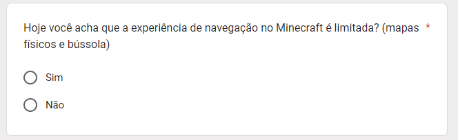

# Validação Protótipo

**Histórico de Revisão**

| Data   | Versão  | Descrição | Autor(es)|
| --- | --- | --- | --- |
| 11/09/2024 | 0.1 | Criação do documento | Patrícia Helena |

## Introdução
Criação e validação do protótipo de uma nova funcionalidade para o jogo Minecraft: **MAPA INTERATIVO**. O objetivo foi prototipar uma ferramenta que facilitasse a navegação e a exploração do mundo do jogo. Após a criação do protótipo, foi aplicado um questionário a 13 jogadores para avaliar a aceitação e a eficácia da nova funcionalidade. 

## Protótipo Mini Mapa

 <i class="fa-solid fa-circle-info"></i> Versão 1 - Autora: Patricia Helena

## Protótipo Mapa Maximizado

 <i class="fa-solid fa-circle-info"></i> Versão 1 - Autora: Patricia Helena

## Questionário sobre a introdução do Mapa
Todo o Questionário foi feito e respondido pela plataforma do GoogleForms.

 <i class="fa-solid fa-circle-info"></i> Versão 1 - Autora: Patricia Helena

 <i class="fa-solid fa-circle-info"></i> Versão 1 - Autora: Patricia Helena

 <i class="fa-solid fa-circle-info"></i> Versão 1 - Autora: Patricia Helena

 <i class="fa-solid fa-circle-info"></i> Versão 1 - Autora: Patricia Helena

## Resultado Questionário sobre a introdução do Mapa

 <i class="fa-solid fa-circle-info"></i> Versão 1 - Autora: Patricia Helena

 <i class="fa-solid fa-circle-info"></i> Versão 1 - Autora: Patricia Helena

 <i class="fa-solid fa-circle-info"></i> Versão 1 - Autora: Patricia Helena

 <i class="fa-solid fa-circle-info"></i> Versão 1 - Autora: Patricia Helena

