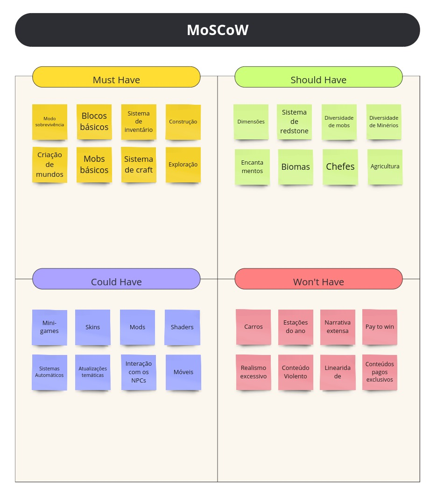

# Rich Picture

**Histórico de Revisão**

| Data       | Versão | Descrição                                                                                 | Autor(es)   |
| ---------- | ------ | ----------------------------------------------------------------------------------------- | ----------- |
| 26/07/2024 | 0.1    | Criação do documento  | Danilo Melo, Patricia Helena, Carlos Eduardo |

---

## Introdução

A técnica MoSCoW é uma metodologia de priorização utilizada em gerenciamento de projetos, especialmente em desenvolvimento de software. MoSCoW é um acrônimo que representa quatro categorias de priorização:

Must have (Deve ter): Requisitos essenciais para o sucesso do projeto. Sem esses itens, o projeto não pode ser considerado um sucesso.
Should have (Deveria ter): Requisitos importantes, mas não essenciais. Eles podem ser adiados se houver limitações de tempo ou recursos, mas são altamente desejáveis.
Could have (Poderia ter): Requisitos que são desejáveis, mas menos críticos. Sua ausência não afetará significativamente o sucesso do projeto.
Won't have (Não terá): Requisitos que foram acordados como não prioritários no momento. Podem ser considerados para versões futuras do projeto.

## Objetivos

A técnica MoSCoW ajuda equipes a gerenciar recursos de forma eficaz, assegurando que as partes mais críticas do projeto sejam concluídas primeiro e proporcionando uma forma clara de comunicar prioridades aos stakeholders.

## Metodologia

Para aplicar essa técnica, utilizamos um quadro na ferramenta Miro e realizamos uma reunião via Google Meet. Em seguida, usamos as informações obtidas durante o [brainstorming](../Elicitacoes/Brainstorming.md) para dividir os elementos nas quatro categorias do MoSCoW.

## Quadro MoSCoW

## Referências

https://rockcontent.com/br/blog/metodo-moscow/