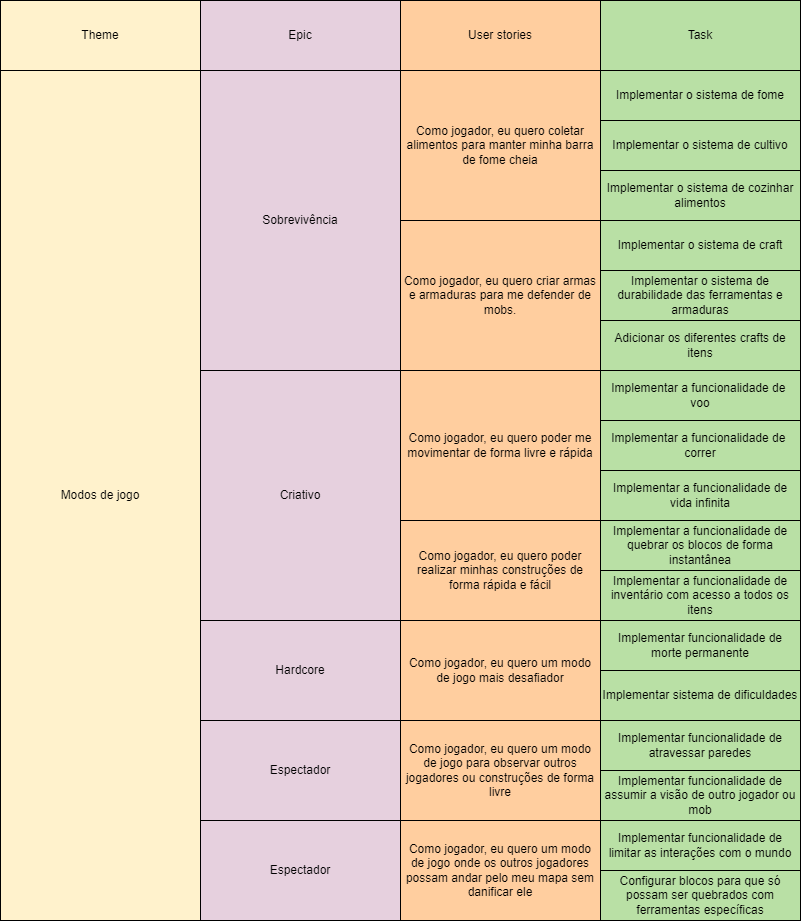
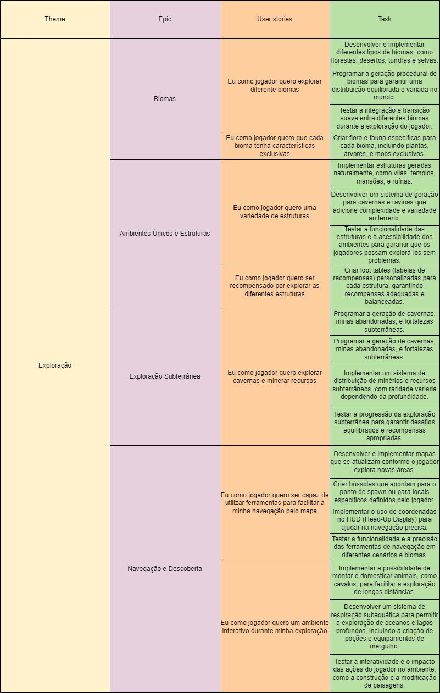

# Epics

**Histórico de Revisão**

| Data   | Versão  | Descrição | Autor(es)|
| --- | --- | --- | --- |
| 16/08/2024 | 0.1 | Criação do documento inicial | Danilo Melo |

## Introdução
O modelo de Epics e Histórias de Usuários estrutura o desenvolvimento de funcionalidades no Minecraft em quatro níveis:

- Theme: Tema geral do jogo, como Exploração.
- Epic: Grandes blocos de funcionalidades, como Biomas Diversos.
- User Stories: Descrevem as necessidades do jogador, como "Quero explorar novos biomas."
- Tasks: Tarefas técnicas que os desenvolvedores realizam para implementar as histórias de usuário.

Esse modelo organiza o processo de desenvolvimento de forma clara, do conceito à implementação, garantindo uma experiência de jogo coesa.

## Modos de jogo

## Exploração
