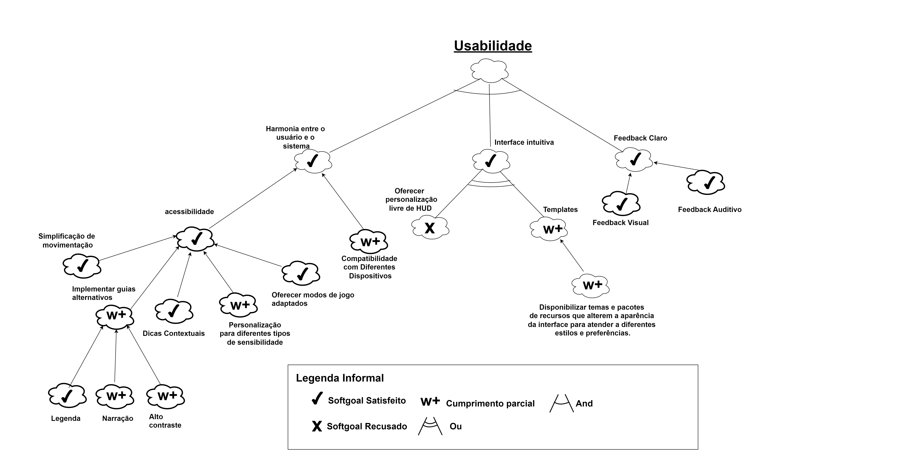
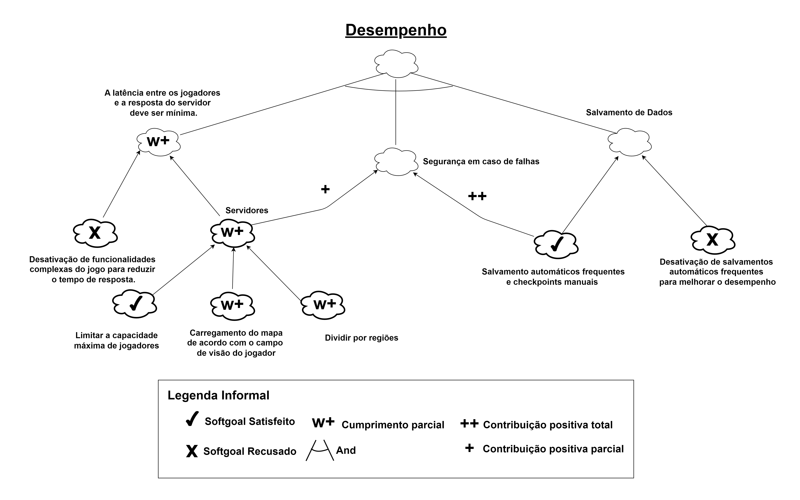

# NFR

## Histórico de Revisão

| Data       | Versão | Descrição            | Autor(es)                                    |
| ---------- | ------ | -------------------- | -------------------------------------------- |
| 21/08/2024 | 0.1    | Criação do documento e adição do NFR de usabilidade| Patricia Helena|
| 21/08/2024 | 0.2    | Adição do NFR de Desempenho| Patricia Helena|

## Introdução
O modelo **NFR Framework** é voltado para a condução da Engenharia de Requisitos com ênfase em requisitos não funcionais, incluindo uma extensão que apoia a análise de suposições para verificar a satisfação das metas flexíveis.

## Usabilidade 

 <i class="fa-solid fa-circle-info"></i> Versão 1 - Autora: Patricia Helena

## Desempenho 

 <i class="fa-solid fa-circle-info"></i> Versão 1 - Autora: Patricia Helena

