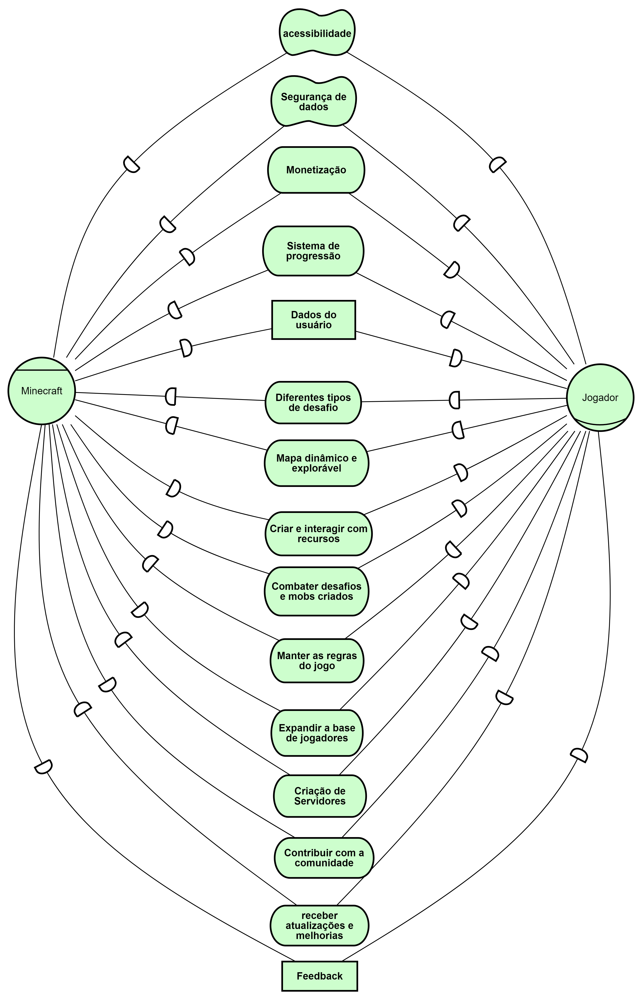
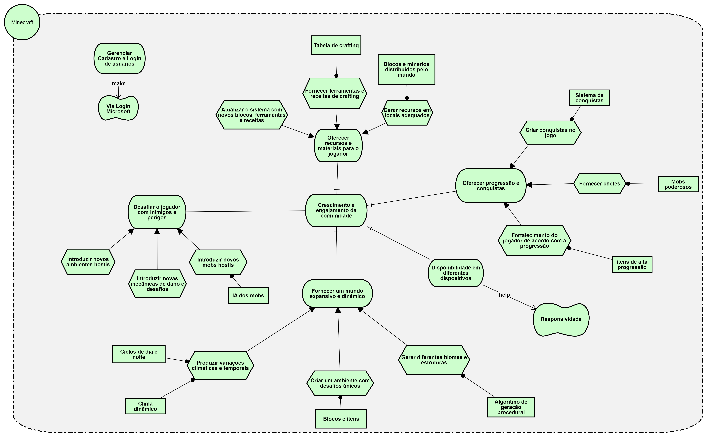
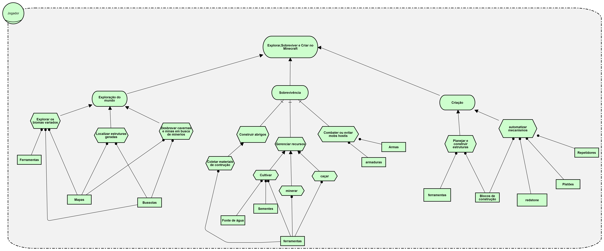

# iSTAR

## Histórico de Revisão

| Data       | Versão | Descrição            | Autor(es)                                    |
| ---------- | ------ | -------------------- | -------------------------------------------- |
| 09/09/2024 | 0.1    | Criação do documento e adição das SDs| Patricia Helena|
| 09/09/2024 | 0.2    | Adição das SRs| Patricia Helena|

## Introdução
**iStar** (ou i* Framework) é uma linguagem de modelagem conceitual usada para descrever e analisar sistemas sócio-técnicos, onde interações entre atores, metas e dependências são fundamentais. Seu foco está em capturar os objetivos dos atores (humanos ou sistemas) e as relações entre eles, permitindo uma visão detalhada de como diferentes partes do sistema cooperam ou conflitam. iStar é amplamente utilizado no design de sistemas complexos, auxiliando na análise de requisitos e na compreensão das dinâmicas entre stakeholders.

## SD - Minecraft e Jogador  

 <i class="fa-solid fa-circle-info"></i> Versão 1 - Autores: Carlos Eduardo e Patricia Helena

## SD - Jogador e Jogador  
.png)

 <i class="fa-solid fa-circle-info"></i> Versão 1 - Autores: Carlos Eduardo e Patricia Helena

## SR - Minecraft  

 <i class="fa-solid fa-circle-info"></i> Versão 1 - Autores: Carlos Eduardo e Patricia Helena

## SR - Jogador  

 <i class="fa-solid fa-circle-info"></i> Versão 1 - Autores: Carlos Eduardo e Patricia Helena

