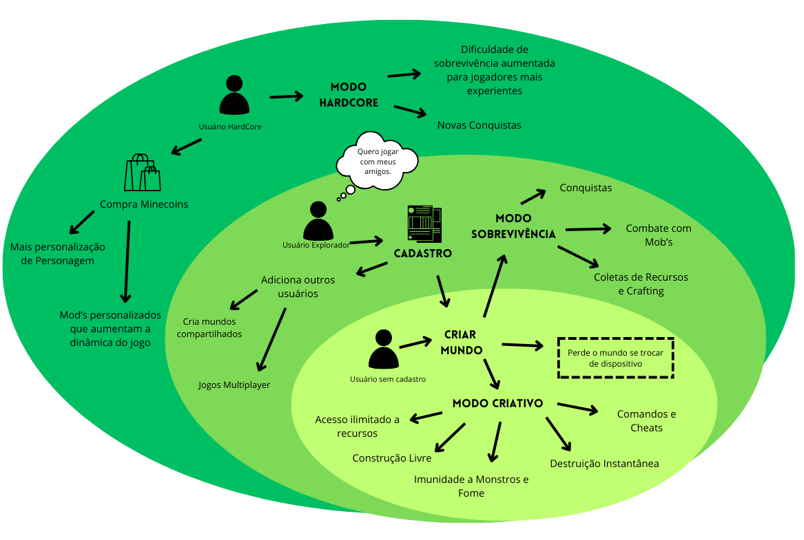
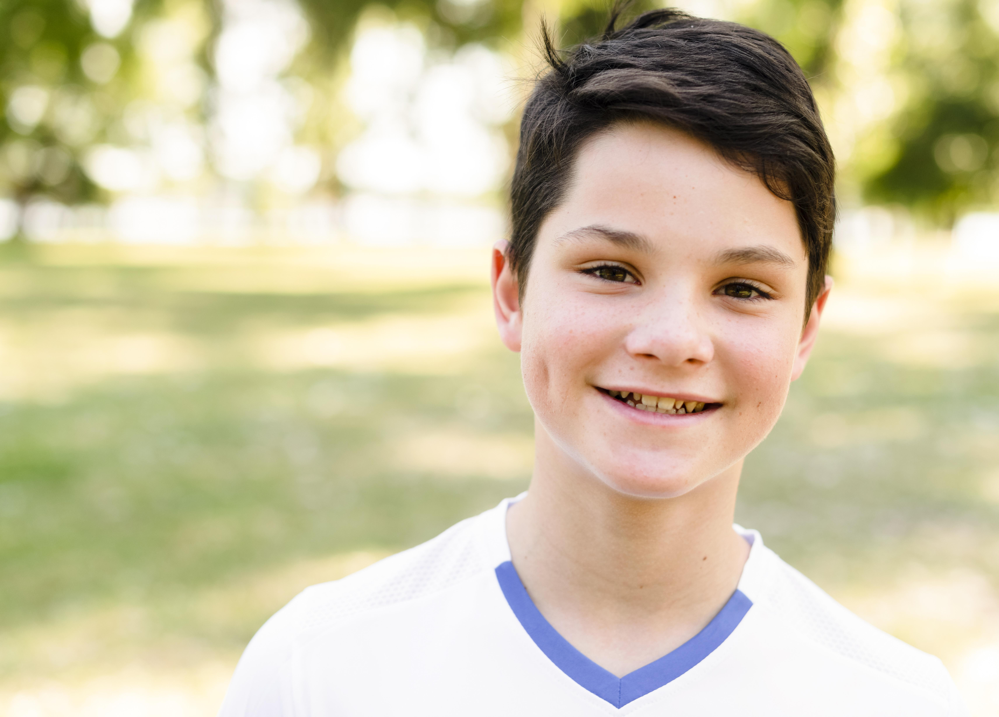

# Personas

## Histórico de Versões

| Data       | Versão | Descrição                      | Autor             |
| :--------: | :----: | :----------:                   | :---------------: |
| 30/07/2024 |  0.1   | Criação das Personas | [Samara Letícia](https://github.com/samarawwleticia)|
| 06/09/2024 | 0.2 | Atualização | [Samara Letícia](https://github.com/samarawwleticia) |

## Introdução

Personas são perfis fictícios que representam os usuários de um projeto. Elas incorporam histórias pessoais, motivações, objetivos, desafios e preocupações, ajudando a desenvolver estratégias para entender melhor o público-alvo.

## Metodologia

Para essa documentação, além de discutirmos sobre as nossas próprias experiências com o jogo, entrevistamos diferentes jogadores de minecraft para saber sobre suas principais atividades, gameplay e o modo como o utilizavam. A partir disso, criamos as seguintes personas: Sarah, Arthur e Victor.

## Personas

 <i class="fa-solid fa-circle-info"></i> Personas - Versão 0.1 - Visão Geral

### Sarah

 <i class="fa-solid fa-circle-info"></i> Persona Sarah by Freepik 

**Perfil de Sarah**

- Idade: 19 anos.
- Profissão: Designer.

**Introdução**

Sarah, uma jovem de 19 anos, é apaixonada por criar construções inovadoras que encantam seus seguidores no YouTube. Utilizando o modo criativo do Minecraft, ela transforma sua imaginação em realidade, projetando e edificando estruturas únicas e impressionantes. Seu canal é um espaço onde ela compartilha suas criações detalhadas e oferece dicas sobre como construir no jogo, atraindo uma audiência dedicada que aprecia sua habilidade em transformar blocos digitais em obras de arte arquitetônicas.

**Frustrações**

1. Ela enfrenta desafios devido às limitações do jogo, e a necessidade de adaptar suas ideias dentro das condições impostas pelo jogo.

### Arthur

 <i class="fa-solid fa-circle-info"></i> Persona Arthur by Freepik 

**Perfil de Artur**

- Idade: 11 anos.
- Profissão: Estudante.

**Introdução**

Artur, um garoto de 11 anos, é um grande fã do Minecraft e adora jogar com seus amigos. Ele se diverte no modo sobrevivência, explorando diferentes biomas e mapas enquanto enfrenta desafios e descobre novos locais. Além disso, Artur gosta de visitar as construções criativas de outros jogadores, buscando inspiração e aprimorando suas próprias habilidades. Para ele, o Minecraft é uma maneira emocionante de se conectar com amigos e mergulhar em um mundo virtual cheio de aventuras.

**Frustrações**

1. O minecraft não possui comando por voz, o que significa que ele precisa digitar pelo chat para se comunicar com seus amigos, tarefa difícil em determinadas situações.
2. Não é possível mandar uma mensagem para um amigo se ele estiver offline.
3. Não é possível entrar em um mundo que você é co-criador com seu amigo se ele estiver offline.

### Victor

 <i class="fa-solid fa-circle-info"></i> Persona Arthur by Freepik 

**Perfil de Victor**

- Idade: 22 anos.
- Profissão: Estudante Universitário.

**Introdução**

Victor é um jogador dedicado do Minecraft que se destaca no modo Hardcore. Seu principal objetivo é derrotar o Ender Dragon e conquistar todas as conquistas disponíveis no jogo. Para intensificar sua experiência e aprimorar a dinâmica do jogo, Victor investe em Minecoins, que usa para adquirir mods e texturas que transformam o ambiente e adicionam novos desafios e elementos ao jogo. Com uma abordagem focada e estratégica, ele busca maximizar sua experiência no Minecraft, explorando todos os recursos que o jogo tem a oferecer.

**Frustrações**

1. Às vezes, mods e texturas adquiridos com Minecoins podem causar bugs ou incompatibilidades que afetam o desempenho do jogo ou a experiência geral.
2. A busca por conquistas e o avanço em um modo tão desafiador podem ser demorados, o que pode levar a uma sensação de progresso lento e frustração.

### Conclusão

Essas personas representam diferentes tipos de jogadores de Minecraft que podem se beneficiar de recursos personalizados no jogo. Cada uma delas tem necessidades e desafios específicos que devem ser atendidos para tornar a experiência de jogo mais eficaz e divertida.

