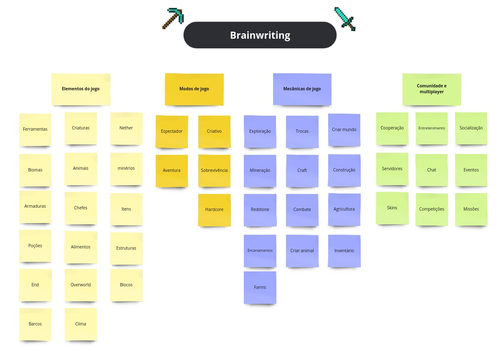

# Brainstorming

## Histórico de Revisão

| Data       | Versão | Descrição            | Autor(es)                                    |
| ---------- | ------ | -------------------- | -------------------------------------------- |
| 29/07/2024 | 0.1    | Criação do documento | Danilo Melo, Carlos Eduardo, Patricia Helena |

---

## Introdução

O brainstorming é uma técnica de geração de ideias que estimula a criatividade e a inovação em ambientes colaborativos, promovendo a liberdade de expressão e a ausência de críticas durante a fase inicial de propostas. Entre as abordagens, destacam-se o Brainwriting, onde os participantes escrevem suas ideias em papel, favorecendo os mais introvertidos, e o Brainstorming em Grupo, guiado por um facilitador que garante a participação equitativa de todos. Ambas as técnicas visam criar um ambiente seguro e colaborativo, onde as ideias podem ser livremente compartilhadas e desenvolvidas, resultando em soluções mais inovadoras.

## Metodologia

Na primeira etapa, utilizamos a técnica de Brainwriting por meio de um board no Miro, que foi dividido em quatro categorias: Elementos do Jogo, Modos de Jogo, Mecânica de Jogo e Comunidade e Multiplayer. Cada participante foi incentivado a contribuir com suas ideias em cada uma dessas categorias. A atividade foi realizada durante uma chamada no Google Meet, permitindo a colaboração em tempo real e garantindo que todos os participantes pudessem interagir e desenvolver as ideias uns dos outros.

## Brainwriting

## Transcrição

| Elementos do Jogo | Modos de Jogo   | Mecânicas de Jogo | Comunidade e Multiplayer |
| ----------------- | --------------- | ----------------- | ------------------------ |
| Ferramentas       | !!Espectador    | Exploração        | Cooperação               |
| Criaturas         | !!Criativo      | Trocas            | Entretenimento           |
| !!Nether          | !!Aventura      | Criar Mundo       | Socialização             |
| Biomas            | !!Sobrevivência | Mineração         | !!Servidores             |
| Animais           | !!Hardcore      | !!Craft           | Chat                     |
| Minérios          |                 | Construção        | Eventos                  |
| Armaduras         |                 | !!Redstone        | !!Skins                  |
| !!Chefes          |                 | Combate           | Competições              |
| Itens             |                 | Agricultura       | Missões                  |
| Poções            |                 | Encantamentos     |                          |
| Alimentos         |                 | Criar Animal      |                          |
| !!Estruturas      |                 | Inventário        |                          |
| !!End             |                 | !!Farms           |                          |
| !!Overworld       |                 |                   |                          |
| Blocos            |                 |                   |                          |
| Barcos            |                 |                   |                          |
| Clima             |                 |                   |                          |
